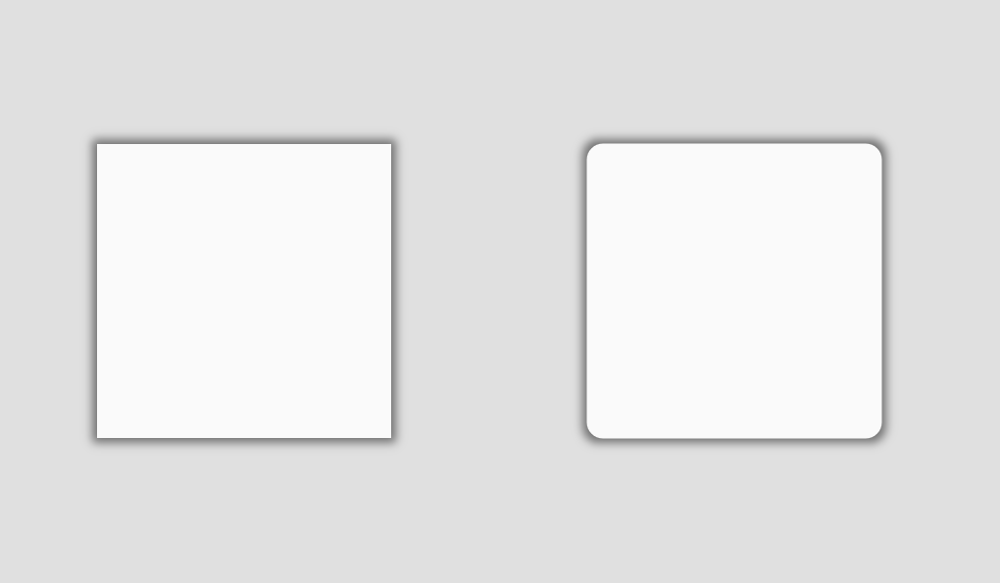
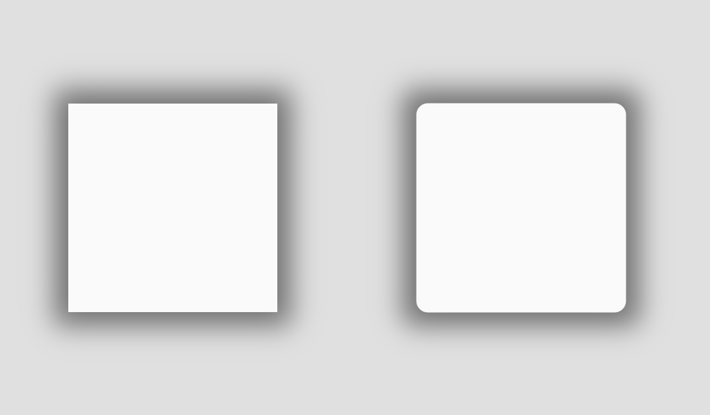

# Godot Rect Shadow Shader
 An implementation [Fast Rounded Rectangle Shadows - Made by Evan](http://www.madebyevan.com/shaders/fast-rounded-rectangle-shadows) in a Godot canvas_item shader.

The demo scene:

## Usage:
Copy rect_shadow.gd and rect_shadow.shader to your project.

Add a ColorRect control as a child to the control you want to add a shadow to.

Check the Show Behind Parent box under Visibility settings.

Adjust the size and position of the ColorRect (shadow) in the inspector.

Add the rect_shadow.gd script to the ColorRect.

Adjust the ColorRect's color to change the shadow color and initial alpha value.

Adjust the Corner Radius if your parent control uses a corner radius in it's stylebox.

In the inspector, create a new ShaderMaterial for the ColorRect and assign the rect_shadow.shader to the shader property of the ShaderMaterial.

Resize the ColorRect in the editor or let the script handle it when it's loaded.

Also, you can connect to signals such as CanvasItem.item_rect_changed() or Control.resized() to make sure the shadow resizes itself properly.

See the rect.tscn and rounded_rect.tscn scenes for more.